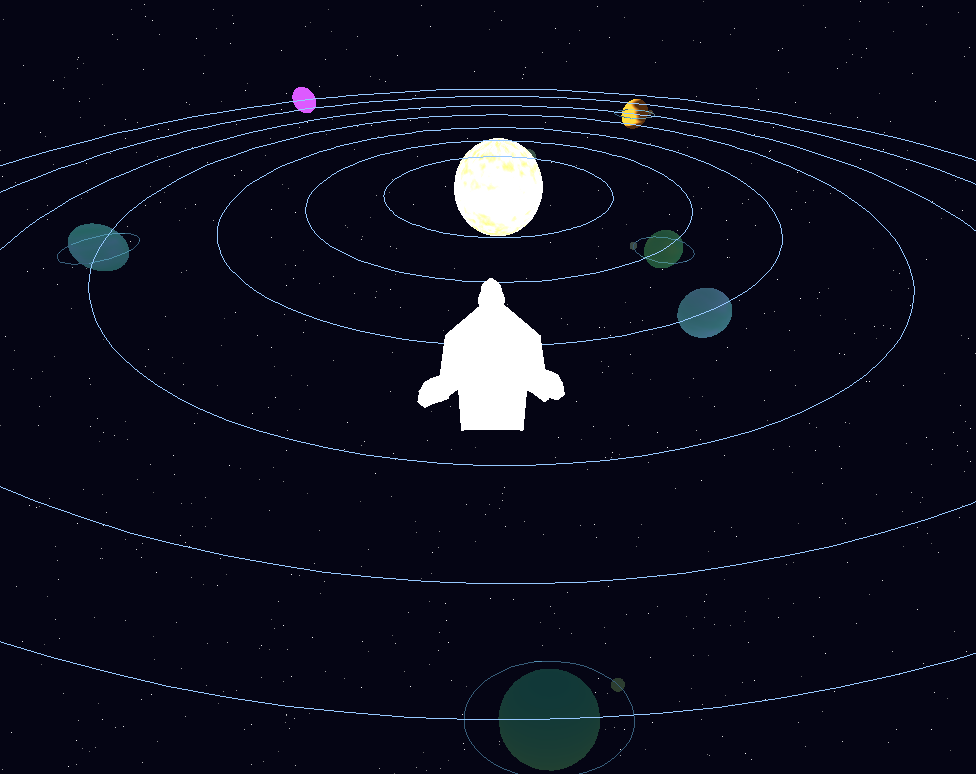
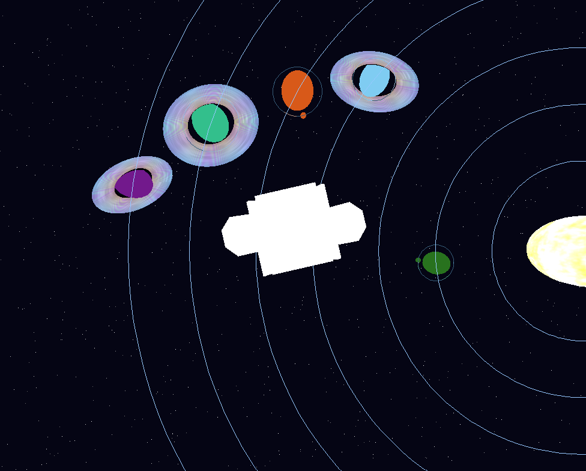
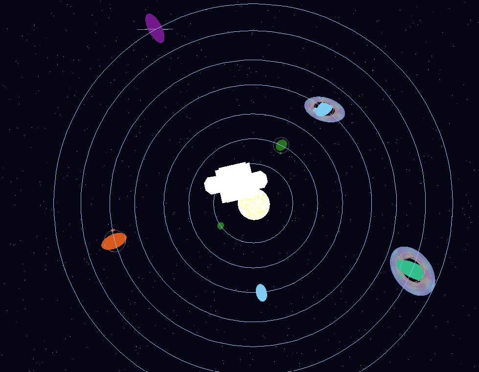
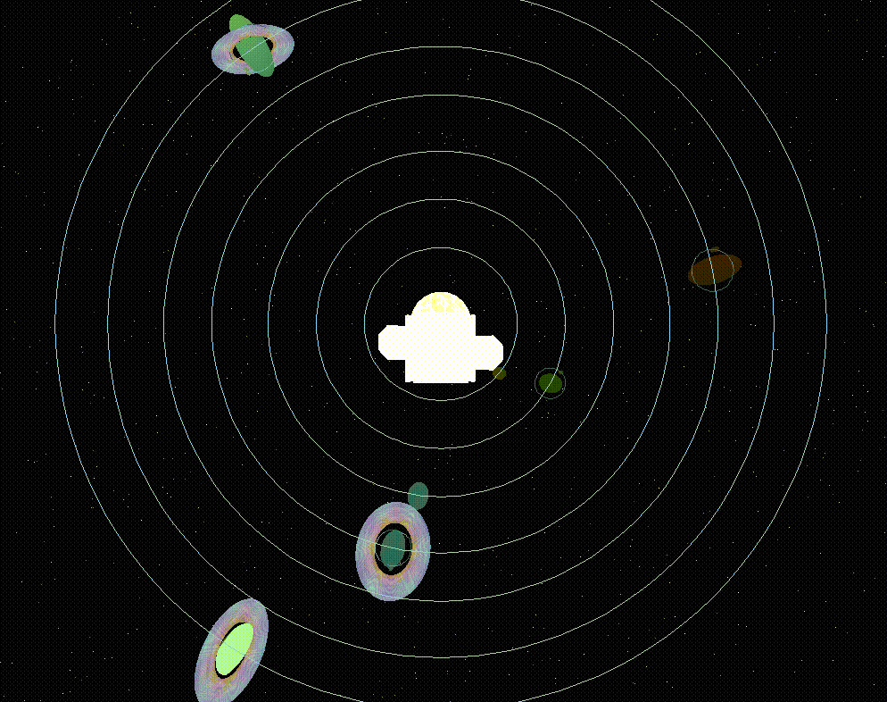

# ‧₊˚✩ Snoopy Space Travel ✩˚₊‧

<div align="center">
	<iframe
		width="460"
		height="259"
		src="https://www.youtube.com/embed/alGQAUomNLw?rel=0&modestbranding=1"
		title="SpaceTravel demo"
		frameborder="0"
		allow="accelerometer; autoplay; clipboard-write; encrypted-media; gyroscope; picture-in-picture"
		allowfullscreen>
	</iframe>
	<p><a href="https://youtu.be/alGQAUomNLw" target="_blank">Ver demo completa en YouTube</a></p>
</div>

Un único ejecutable combina el tour del sistema solar con la nave de Snoopy. Todo el render ocurre en CPU usando nuestro framebuffer hecho a mano más una ventana de Raylib. 


## Galería


```markdown




```

## Cómo ejecutarlo

```powershell
cargo run --release
```

El perfil `--release` mantiene 60–90 FPS en laptops medias.

## Controles

- `W` / `S`: avanzar o retroceder la nave (dirección de la nariz)
- `A` / `D`: desplazamiento lateral relativo al cuerpo
- `Q` / `E`: subir / bajar
- Flechas: orbitar la cámara alrededor de Snoopy
- `Shift` izq./der.: modo inspección (zoom extremo + cámara pegada al casco)
- `Z` / `X`: zoom gradual manual
- `1`: warp al Sol
- `2`..`8`: warp a Asteroide, Selva Boreal, Planeta Gélido, Cristal, Fuego, Oceánico y Nube
- `F1`..`F4`: warp directo a las lunas (órbitas de Rocoso y Cristal)
- `B`: cámara cenital para comparaciones de rúbrica
- `P`: alterna calidad alta (sombreadores completos del branch Static-Shaders) contra modo rendimiento
- `Esc`: salir

## Que se puede ver

- Estrella central más 7 planetas estilizados, cada uno con los patrones del branch `Static-Shaders` (rocoso, gas gigante, alien, lava, hielo).
- Nuevos anillos procedurales inspirados en `cafetowake/GraficasAndSpace` con doble banda, ruido granular y leve inclinación.
- Dos lunas orbitando (una rocosa y otra helada) con sombreadores propios y teclas de warp dedicadas.
- Snoopy renderizado desde `models/Snoopy.obj` y coloreado con el `mtl`; el shader 999 deja el modelo totalmente blanco para resaltar sobre los planetas.
- Modo inspección (mantén `Shift`) que acerca la cámara, aumenta la resolución del shader y empuja la nave casi contra la superficie para apreciar las texturas.
- Guías de órbita y skybox procedural de 800 estrellas para mantener contexto espacial.

## Notas de rendimiento y sombreado

- El proyecto arranca en alta fidelidad (malla densa + shaders completos). Presiona `P` si necesitas subir FPS; al entrar en modo inspección se restaura la calidad automáticamente.
- Los planetas usan exactamente los mismos parámetros que el branch `Static-Shaders`, así que los colores y ruidos coinciden con las entregas anteriores.
- Los anillos se rasterizan como discos planos con su propio shader (`pattern 300`) para poder mezclar bandas, ruido y pulsos de luz sin trucos en las esferas.

## Lista de verificación de la rúbrica

- ✅ Un único binario (`cargo run --release`) con sistema solar, Snoopy y warp keys.
- ✅ Controles y cámara idénticos a la referencia de Bianca; incluye vista cenital y bird-eye.
- ✅ Nave personalizada (Snoopy) + assets OBJ/MTL dentro del repo.
- ✅ Planetario completo con texturas procedurales, lunas, anillos, skybox y guías de órbita.
- ✅ Evita colisiones empujando la nave fuera del Sol, planetas y lunas; el modo inspección permite acercarse sin atravesar geometría.
- ✅ Warp animado + flash visual para soles/planetas/lunas.
- ✅ README en español con pasos claros, controles y secciones para video/capturas.


## Estructura del repositorio

```
src/
	main.rs           -> bucle principal, cámara, warp y Snoopy
	framebuffer.rs    -> framebuffer en CPU + helpers de color
	triangle.rs       -> rasterizador y barycentría en software
	shader.rs         -> sombreadores estáticos y procedurales
	obj_loader.rs     -> importador OBJ/MTL con centrado automático

models/
	Snoopy.obj        -> geometría de la nave
	Snoopy.mtl        -> color base del modelo

docs/               -> coloca aquí capturas y gifs referenciados en la galería
```
